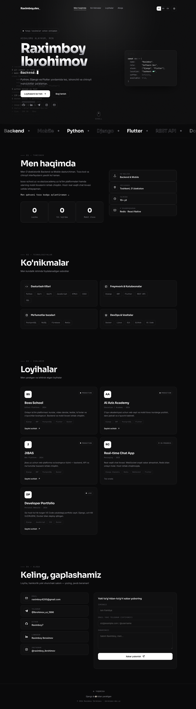
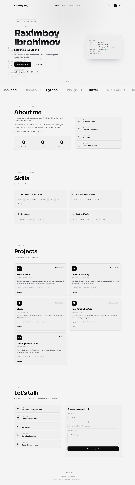

<!-- ============================ HEADER ============================ -->
<div align="center">

# `</>` Raximboy Ibrohimov — Developer Portfolio

### A monochrome, multilingual, animated portfolio built with Django

<p>
  <a href="https://ibrohimov-dev.uz"></a>
</p>

<p>
  
  
  
  
  
  
</p>

</div>

<br/>

<!-- ============================ PREVIEW ============================ -->
<div align="center">
  
  <br/><br/>
  
</div>

<br/>

## ✨ About

A personal developer portfolio with a clean **monochrome / editorial** aesthetic and modern micro-interactions.
Single-page Django app, fully **trilingual (UZ · RU · EN)**, with a **dark / light** theme switch and a working
**contact form** that delivers messages straight to Telegram. Deployed with Docker behind Nginx.

> 🇺🇿 Backend & Mobile developer from Tashkent, Uzbekistan — Python · Django · Flutter.

<br/>

## 🚀 Features

| | |
|---|---|
| 🎬 **Animated hero** | Letter-by-letter name reveal, falling numeric "matrix" rain, live code-typing terminal that prints build/test/deploy results |
| 🌗 **Two themes** | Pure black/white **dark** (default) and inverse **light** — saved to `localStorage` |
| 🌐 **3 languages** | Uzbek · Russian · English, switched instantly client-side (no reload) |
| 💡 **Micro-interactions** | Cursor-follow spotlight, magnetic buttons, scroll-reveal, count-up stats, infinite marquee, scroll-spy nav |
| ✉️ **Contact form → Telegram** | CSRF-protected, honeypot + per-IP rate limiting, sent via the Telegram Bot API |
| 📱 **Responsive & accessible** | Mobile-first layout, keyboard-operable, focus rings, reduced-motion support |
| 🐳 **Production-ready** | Dockerized (Gunicorn + WhiteNoise), fail-safe settings (`DEBUG`/`SECRET_KEY` guards) |

<br/>

## 🧰 Tech Stack

**Backend:** Python · Django · WhiteNoise · Gunicorn
**Frontend:** Vanilla JavaScript · HTML5 · CSS3 (custom properties, Canvas) · Sora / Inter / JetBrains Mono
**DevOps:** Docker · docker-compose · Nginx · Let's Encrypt

<br/>

## ⚡ Quick Start

```bash
# 1) Clone
git clone git@github.com:Raximboy7/Portfolio.git
cd Portfolio

# 2) Virtual env + deps
python3 -m venv venv && source venv/bin/activate
pip install -r requirements.txt

# 3) Env
cp .env.example .env          # set SECRET_KEY, DEBUG, TELEGRAM_* …

# 4) Run
python manage.py migrate
python manage.py runserver    # → http://127.0.0.1:8000
```

<br/>

## 🐳 Deploy (Docker)

```bash
cp .env.example .env          # DEBUG=False, SECRET_KEY, TELEGRAM_BOT_TOKEN, TELEGRAM_CHAT_ID
docker compose up --build -d  # serves on :8000
```

Point your server's Nginx (`proxy_pass http://127.0.0.1:8000;`) to the container and add SSL with
`certbot --nginx -d ibrohimov-dev.uz`.

<br/>

## ✏️ Customize

| What | Where |
|---|---|
| All text & translations (UZ/RU/EN) | `portfolio/static/portfolio/js/i18n.js` |
| Projects list | `portfolio/static/portfolio/js/projects.js` |
| Name, links, social handles | `portfolio/views.py` → `SITE` |
| Colors, fonts, effects | `portfolio/static/portfolio/css/style.css` |

<br/>

## 📫 Connect

<p>
  <a href="https://ibrohimov-dev.uz"></a>
  <a href="https://t.me/Ibrohimov_uz_1996"></a>
  <a href="https://www.instagram.com/raximboy_ibrohimov/"></a>
  <a href="https://www.linkedin.com/in/raximboy-ibroximov-a75855268/"></a>
  <a href="mailto:raximboy4200@gmail.com"></a>
</p>

<div align="center"><sub>© 2026 Raximboy Ibrohimov · Built with Django & ☕</sub></div>
